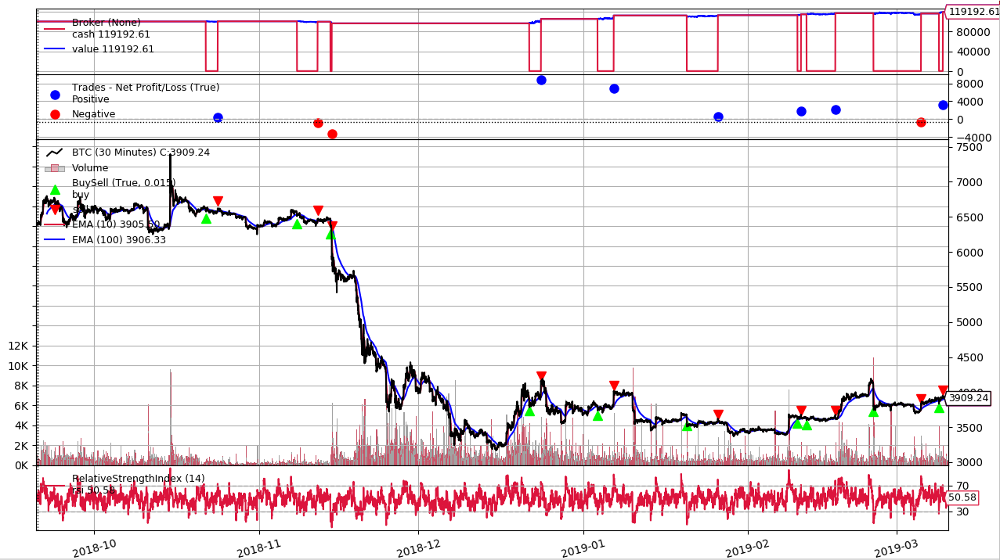

# A Binance Futures trading and backtesting framework based on rodrigo-brito's backtrader-binance-bot

### Special thanks to rodrigo-brito

### Installation

Activating [Virtualenv](https://virtualenv.pypa.io/en/latest/)
```
make init
source venv/bin/activate
```

Installing dependencies
```
make install
```

Start application
```
./main.py
```

## Results




```
Starting Portfolio Value: 100000.00
Final Portfolio Value: 119192.61

Profit 19.193%
Trade Analysis Results:
               Total Open     Total Closed   Total Won      Total Lost     
               0              10             7              3              
               Strike Rate    Win Streak     Losing Streak  PnL Net        
               1              5              2              19192.61       
SQN: 1.75
```

## To do list

多策略，多数据源，多时间周期的backtrader框架

自身带有前进式回测分析WFA

策略能够方便的加入一些仓位控制方法（简单如凯利公式）
#

## 至今的所有修改进度

20211201
多策略部分除了分配持仓比例部分未写好其它部分已经完全搞定（还未debug）

目前能加入多币种多时间周期（未debug）

将原先的production.py复制了出来, 需要参照OptStrategy来要写成能够用来前进式优化的框架WFO

保留原先OptStrategy, 作为单策略优化的框架

需要将TestStrategy修改为一次能够检验多策略, 多数据源的框架

Production实盘框架中的WFO功能替换为给用户发送回测任务, 手动回测优化

接触到了新的优化模块blackbox, 还未试用

当前正在完善WFO单策略优化的内容
